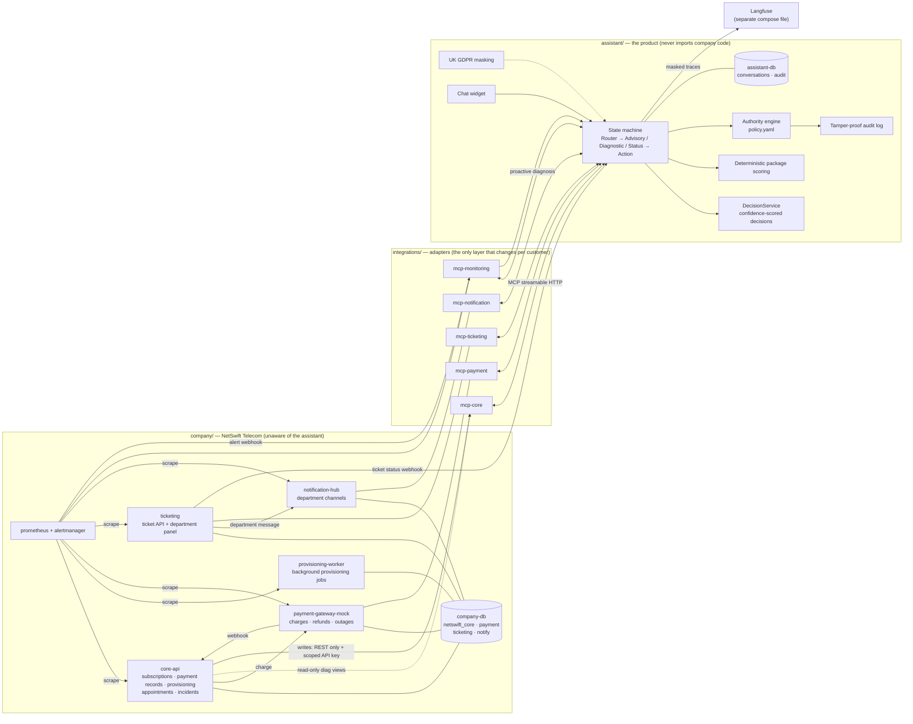

# NetSwift Telecom + External AI Support Assistant

A realistic rehearsal of an AI support assistant **bolted onto** an enterprise from outside.
The repo is made of two separate worlds, and the separation is deliberately strict:

- **`company/` — NetSwift Telecom:** a fictional UK fibre broadband provider. It has its own
  databases, its own REST APIs, its own ticketing system and its own monitoring stack. The
  assistant's name never appears in its code; it behaves as if it were written without any
  knowledge of the assistant.
- **`assistant/` — the product:** a guest system that knows nothing about the company's code.
  It reaches the company only through the adapters (MCP servers) under `integrations/`.

Moving to a new customer changes only `integrations/` and `config/tenants/<customer>/`.

## Architecture



### Invariants (all enforced by tests)

| Rule | How it is guaranteed |
|---|---|
| The assistant cannot import company code | `tests/architecture/test_boundaries.py` AST scan |
| Company code knows nothing about the assistant | Same test: the words `assistant`, `llm`, `openai`, `mcp` … are banned in the company tree |
| The assistant **cannot write** to a company database | The `readonly_diag` role can only `SELECT` from `diag.*` views; `core.*` is closed entirely (`tests/integration/test_readonly_role.py`) |
| No identity data in diagnostic data | `diag.*` views have no `national_id`/address columns; tested |
| The model cannot decide its own authority | Every action first goes through the authority engine that interprets `policy.yaml`; undefined actions are denied |
| The audit log cannot be altered | `BEFORE UPDATE OR DELETE` trigger on `asst.audit_entries` + a hash chain |

## Setup

All you need is Docker. (Because the host is arm64, Python 3.12 + FastAPI + PostgreSQL were
used instead of .NET + MS SQL Server; the reasoning is in `CLAUDE.md`.)

```bash
cp .env.example .env          # fill in OPENAI_API_KEY with your own key
make up                       # company + assistant, single command
make smoke                    # health and seed checks
make open                     # prints the demo URLs
```

| Interface | URL |
|---|---|
| Customer chat widget (embedded in the NetSwift site) | http://localhost:8080 |
| Department ticket panel | http://localhost:8003/agent |
| Department channels (stand-in for Teams/Slack) | http://localhost:8004 |
| Company API docs (OpenAPI) | http://localhost:8001/docs |
| Prometheus / Alertmanager | http://localhost:9091 · http://localhost:9093 |

Observability (optional, separate file — details in `docs/observability.md`):

```bash
make up-observability         # + self-hosted Langfuse (with its own PostgreSQL)
```

With `LANGFUSE_ENABLED=false`, or while Langfuse is down, the assistant is not affected at
all; traces fall back to a local JSONL file.

## Tests

```bash
make test               # every suite, each in its own pytest process
make test-arch          # architecture boundary tests only
make test-integration   # end-to-end tests against the running stack
```

## Chaos — failure injection

```bash
make chaos SCENARIO=stuck_provisioning
make chaos SCENARIO=regional_outage CHAOS_ARGS="--region LDN-CAM"
make chaos-status
make chaos-reset
```

| Scenario | What happens at the company | What the assistant should do |
|---|---|---|
| `stuck_provisioning` | A provisioning job gets stuck | Fixes it itself: restarts the job, opens no ticket |
| `paid_not_active` | Payment taken, subscription never activated | Applies the small fix; hands over to Billing if a refund is needed |
| `regional_outage` | An infrastructure fault in one region affects every customer there | Links to the existing incident, **opens no ticket per customer**, may offer up to £5 compensation with consent |
| `double_charge` | The same amount is taken twice | Detects it and, lacking refund authority, hands it to Billing with the evidence |
| `missed_installation` | An installation appointment is missed | Opens a structured ticket for the Field Installation Team |
| `payment_down` | The payment service goes down completely | A monitoring alert fires and the assistant starts a proactive diagnosis |

## Demo walkthrough

> Step by step, as if presenting to a customer.

1. **Set the scene.** `make up && make open`. Open three tabs: the customer widget, the
   department ticket panel and the department channels. Frame it: "These three are the
   company's own world; the assistant knows the code of none of them."
2. **Advice.** Without signing in, ask the widget: *"There are 4 of us at home, we stream
   shows every evening, my budget is £50."* The assistant asks 3–5 questions and recommends a
   package. The point to stress: **the recommendation comes from a deterministic scoring
   function**; the model only asks the questions and explains the result — the same input
   always gives the same recommendation.
3. **A problem the assistant fixes itself.** `make chaos SCENARIO=stuck_provisioning` (sign
   in with the customer number in the output) → *"My internet still hasn't been switched
   on."* The assistant checks the record, the payment and the provisioning job, and restarts
   the stuck job. **No ticket is opened.**
4. **The authority boundary.** `make chaos SCENARIO=double_charge` → *"I've been charged
   twice."* The assistant detects the double charge, but it has **no** refund authority: it
   opens a ticket for Billing with the evidence (both payment IDs, the amount, the time gap,
   the steps it tried). Open it in the ticket panel and show that the department does not
   have to ask the customer the same questions again.
5. **A known incident.** `make chaos SCENARIO=regional_outage` → ask with two different
   customer numbers from the same region. The assistant links both to the **same** incident;
   no second ticket is opened.
6. **Proactive behaviour.** `make chaos SCENARIO=payment_down` → the Prometheus alert fires,
   Alertmanager notifies both the department channel and the assistant, and the assistant
   starts a diagnosis on its own.
7. **Closing the loop.** Change the ticket's status in the ticket panel → the webhook reaches
   the assistant → a notification appears in the customer's widget.
8. **Transparency and compliance.** Open the widget's "What did the assistant do?" panel:
   every step, its reason and the record it relied on. Then verify the audit log's hash chain
   with `docker compose exec assistant …` and show that the database rejects
   `UPDATE`/`DELETE`. UK GDPR: NI numbers, phone numbers and addresses are masked in
   everything sent to the model and to traces.
9. **Wrap-up.** Open `config/tenants/_example/`: moving to a second customer changes only this
   folder and, if needed, new adapters.

Run `make chaos-reset` after each scenario.

## Second tenant (proof of multi-tenancy)

`config/tenants/_example/` is not an empty template but a working second customer: a
different account number format (`OR-2045118`), different department names, a stricter
handover threshold, **no** compensation authority, **with** authority to reschedule
appointments, and budget-focused recommendation weights.

```bash
docker compose run --rm -e TENANT=_example test-runner \
  env PYTHONPATH=/workspace/assistant python -c "
from fastapi.testclient import TestClient
from api.main import app
with TestClient(app) as c: print(c.post('/api/login', json={'customer_no':'NS-100001'}).json())"
```

Same image, same code: a customer number valid for `netswift` gets a format error here, the
sign-in page shows that tenant's label, and the authority engine takes its decisions from that
customer's `policy.yaml`. Details and honest limits: `config/tenants/_example/README.md`.

## Evaluation

```bash
make eval
```

For every chaos scenario, user messages in different tones (polite / angry / vague) are run,
plus 10 customer profiles for advisory mode; the right mode, the right diagnosis, the right
action or the right department, and "no unnecessary ticket" are measured, and a pass-rate
report is produced at the end. The default run is deterministic and needs no API key
(`EVAL_MODE=scripted`); set `EVAL_MODE=live` to run against a real model.

## More

- `CLAUDE.md` — architecture rules and working agreements
- `docs/contracts.md` — schemas, endpoint signatures, webhook payloads (single source of truth)
- `docs/observability.md` — Langfuse setup and tracing
- `company/monitoring/README.md` — alert rules and which department each one goes to
