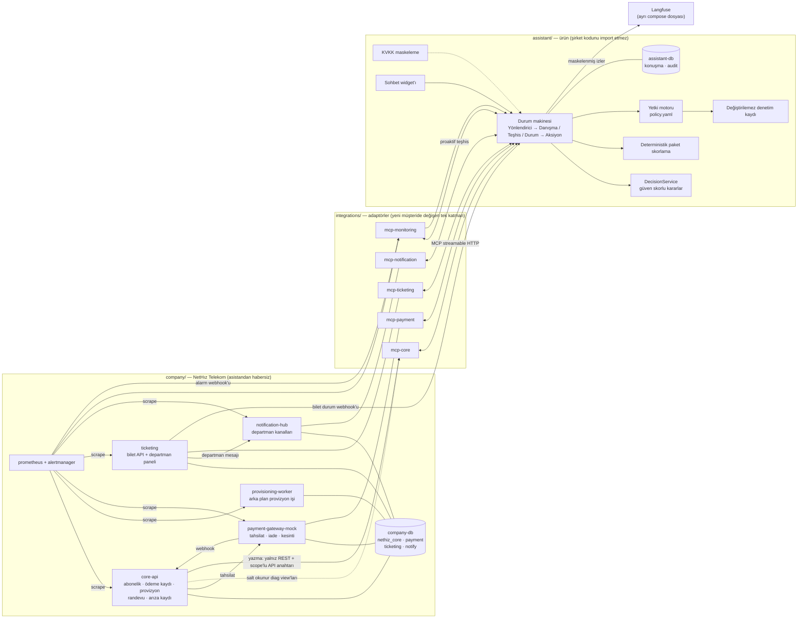

# NetHız Telekom + Harici AI Destek Asistanı

Kurumsal bir şirkete **dışarıdan eklenen** AI destek asistanının gerçekçi provası.
Repo iki ayrı dünyadan oluşur ve bu ayrım bilerek serttir:

- **`company/` — NetHız Telekom:** hayali bir fiber internet sağlayıcısı. Kendi veritabanları,
  kendi REST API'leri, kendi bilet sistemi, kendi izleme yığını var. Kodunda asistanın adı bile
  geçmez; asistandan habersiz yazılmış gibi davranır.
- **`assistant/` — ürün:** şirketin kodunu hiç bilmeyen misafir sistem. Şirkete yalnızca
  `integrations/` altındaki adaptörler (MCP sunucuları) üzerinden erişir.

Yeni bir müşteriye geçmek için yalnızca `integrations/` ve `config/tenants/<müşteri>/` değişir.

## Mimari



### Değişmez kurallar (hepsi testle zorlanır)

| Kural | Nasıl garanti altına alındı |
|---|---|
| Asistan şirket kodunu import edemez | `tests/architecture/test_boundaries.py` AST taraması |
| Şirket kodu asistandan habersizdir | Aynı test: `assistant`, `llm`, `openai`, `mcp` … kelimeleri şirket ağacında yasak |
| Asistan şirket veritabanına **yazamaz** | `readonly_diag` rolü yalnız `diag.*` view'larını `SELECT` edebilir; `core.*` tamamen kapalı (`tests/integration/test_readonly_role.py`) |
| Teşhis verisinde kimlik bilgisi yok | `diag.*` view'larında `national_id`/adres kolonu yok; test ediyor |
| Model kendi yetkisine karar veremez | Her aksiyon önce `policy.yaml`'ı yorumlayan yetki motorundan geçer; tanımsız aksiyon reddedilir |
| Denetim kaydı değiştirilemez | `asst.audit_entries` üzerinde `BEFORE UPDATE OR DELETE` trigger'ı + hash zinciri |

## Kurulum

Gereken tek şey Docker. (Makine arm64 olduğu için .NET + MS SQL Server yerine
Python 3.12 + FastAPI + PostgreSQL kullanıldı; gerekçe `CLAUDE.md`'de.)

```bash
cp .env.example .env          # OPENAI_API_KEY'i kendi anahtarınla doldur
make up                       # şirket + asistan, tek komut
make smoke                    # sağlık ve seed kontrolü
make open                     # demo adreslerini yazdırır
```

| Arayüz | Adres |
|---|---|
| Müşteri sohbet widget'ı (NetHız sitesine gömülü) | http://localhost:8080 |
| Departman bilet paneli | http://localhost:8003/agent |
| Departman kanalları (Teams/Slack yerine) | http://localhost:8004 |
| Şirket API dokümanı (OpenAPI) | http://localhost:8001/docs |
| Prometheus / Alertmanager | http://localhost:9091 · http://localhost:9093 |

İzleme (isteğe bağlı, ayrı dosya — ayrıntı: `docs/observability.md`):

```bash
make up-observability         # + self-hosted Langfuse (kendi PostgreSQL'i ile)
```

`LANGFUSE_ENABLED=false` iken ya da Langfuse ayakta değilken asistan hiç etkilenmez;
izler yerel JSONL dosyasına düşer.

## Testler

```bash
make test               # tüm paketler, her biri kendi pytest sürecinde
make test-arch          # yalnız mimari sınır testleri
make test-integration   # çalışan yığına karşı uçtan uca testler
```

## Chaos — arıza enjeksiyonu

```bash
make chaos SCENARIO=stuck_provisioning
make chaos SCENARIO=regional_outage CHAOS_ARGS="--region IST-KAD"
make chaos-status
make chaos-reset
```

| Senaryo | Şirkette ne olur | Asistandan beklenen |
|---|---|---|
| `stuck_provisioning` | Provizyon işi takılı kalır | Kendi çözer: işi yeniden başlatır, bilet açmaz |
| `paid_not_active` | Ödeme alınmış, abonelik aktifleşmemiş | Küçük düzeltmeyi yapar; iade gerekiyorsa Faturalama'ya aktarır |
| `regional_outage` | Bir bölgede altyapı arızası, tüm müşteriler etkilenir | Mevcut olaya bağlar, **müşteri başına bilet açmaz**, onayla ≤50 TL telafi önerebilir |
| `double_charge` | Aynı tutar iki kez tahsil edilir | Tespit eder, iade yetkisi olmadığı için kanıtlarıyla Faturalama'ya aktarır |
| `missed_installation` | Kurulum randevusu kaçırılır | Saha Kurulum Ekibi'ne yapılandırılmış bilet açar |
| `payment_down` | Ödeme servisi tamamen çöker | İzleme alarmı tetiklenir, asistan proaktif teşhis başlatır |

## Demo akışı

> Müşteriye sunum yapar gibi, adım adım.

1. **Sahne kurulumu.** `make up && make open`. Üç sekme aç: müşteri widget'ı, departman bilet
   paneli, departman kanalları. "Bu üçü şirketin kendi dünyası; asistan bunların hiçbirinin
   kodunu bilmiyor" diye çerçevele.
2. **Danışma.** Widget'tan giriş yapmadan sor: *"Evde 4 kişiyiz, akşamları dizi izliyoruz,
   bütçem 500 TL."* Asistan 3–5 soru sorar ve paket önerir. Vurgulanacak nokta: **öneri
   deterministik bir skorlama fonksiyonundan gelir**, model yalnızca soruyu sorar ve sonucu
   Türkçe anlatır — aynı girdi her zaman aynı öneriyi verir.
3. **Asistanın kendi çözdüğü sorun.** `make chaos SCENARIO=stuck_provisioning` (çıktıdaki
   müşteri numarasıyla giriş yap) → *"İnternetim hâlâ açılmadı."* Asistan kaydı, ödemeyi ve
   provizyon işini kontrol eder, takılı işi yeniden başlatır. **Bilet açılmaz.**
4. **Yetki sınırı.** `make chaos SCENARIO=double_charge` → *"Hesabımdan iki kez para çekilmiş."*
   Asistan çift tahsilatı tespit eder, ama iade yetkisi **yoktur**: Faturalama'ya kanıtlarla
   (iki ödeme ID'si, tutar, zaman farkı, denediği adımlar) bilet açar. Bilet panelinde aç ve
   göster: departman müşteriye aynı soruları yeniden sormak zorunda değil.
5. **Genel olay.** `make chaos SCENARIO=regional_outage` → aynı bölgeden iki farklı müşteri
   numarasıyla sor. Asistan ikisini de **aynı** olaya bağlar; ikinci bir bilet açılmaz.
6. **Proaktif davranış.** `make chaos SCENARIO=payment_down` → Prometheus alarmı tetiklenir,
   Alertmanager hem departman kanalına hem asistana gider; asistan teşhisi kendiliğinden
   başlatır.
7. **Döngünün kapanması.** Bilet panelinden biletin durumunu değiştir → webhook asistana
   ulaşır → müşteri widget'ında bilgilendirme görünür.
8. **Şeffaflık ve uyum.** Widget'taki "Asistan ne yaptı?" panelini aç: her adım, gerekçesi ve
   dayandığı kayıt. Ardından `docker compose exec assistant …` ile audit kaydının hash
   zincirini doğrula; veritabanının `UPDATE`/`DELETE`'i reddettiğini göster. KVKK: modele ve
   izlere giden veride TC/telefon/adres maskeli.
9. **Kapanış.** `config/tenants/_example/` klasörünü aç: ikinci bir müşteriye geçmek için
   değişen tek şey bu klasör ve gerekirse yeni adaptörler.

Her senaryodan sonra `make chaos-reset`.

## İkinci kiracı (çok kiracılılık kanıtı)

`config/tenants/_example/` boş bir şablon değil, çalışan ikinci bir müşteri: farklı abone
numarası formatı (`OR-2045118`), farklı departman adları, daha katı devretme eşiği, telafi
yetkisi **yok**, randevu değiştirme yetkisi **var**, bütçe odaklı öneri ağırlıkları.

```bash
docker compose run --rm -e TENANT=_example test-runner \
  env PYTHONPATH=/workspace/assistant python -c "
from fastapi.testclient import TestClient
from api.main import app
with TestClient(app) as c: print(c.post('/api/login', json={'customer_no':'NH-100001'}).json())"
```

Aynı imaj ve aynı kodla: `nethiz`'de geçerli olan müşteri numarası burada format hatası
alır, giriş ekranı kiracının etiketini gösterir, yetki motoru kararlarını o müşterinin
`policy.yaml`'ından verir. Ayrıntı ve dürüst sınırlar: `config/tenants/_example/README.md`.

## Değerlendirme

```bash
make eval
```

Her chaos senaryosu için farklı üsluplarda (kibar / sinirli / eksik bilgi veren) Türkçe
kullanıcı mesajları ve danışma modu için 10 kullanıcı profili çalıştırılır; doğru mod, doğru
teşhis, doğru aksiyon ya da doğru departman ve "gereksiz bilet açılmaması" ölçülür, sonunda
bir başarı raporu üretilir. Varsayılan koşu deterministiktir ve API anahtarı gerektirmez
(`EVAL_MODE=scripted`); gerçek modelle çalıştırmak için `EVAL_MODE=live`.

## Daha fazlası

- `CLAUDE.md` — mimari kurallar ve çalışma anlaşmaları
- `docs/contracts.md` — şemalar, endpoint imzaları, webhook payload'ları (tek doğruluk kaynağı)
- `docs/observability.md` — Langfuse kurulumu ve izleme
- `company/monitoring/README.md` — alarm kuralları ve hangi departmana gittikleri
